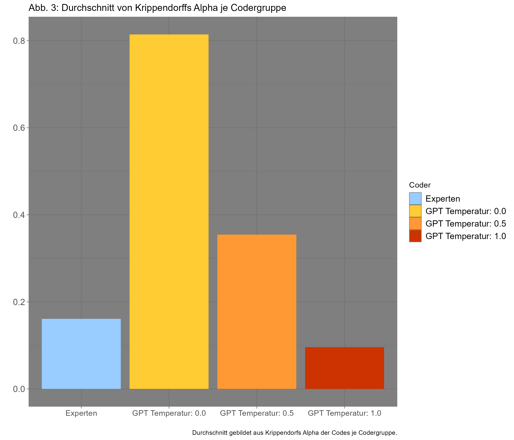

# bachelor-thesis
This repo contains my bachelor thesis: the thesis as pdf, the corresponding code files (R, python), data, grading and appended files.

# Topic
[Abstract](Abstract_degree_project.pdf)
[Full Text (in german](Krabbe_Degree_project.pdf)

In my thesis I investigated the suitability of LLMs for qualitative textual content analysis. Textual content analysis is a common method in the qualitative social sciences to process text data and ultimately gather insights from it. In this method, there are two approaches. In the decductive approach a code book is created, containing codes for relevant textual contents, characteristics or emotions, which are then applied to a text to mark their occurences and therefore creating a structure that is easier to analyse. In the inductive approach, the codes itself are generated from a text and can then be used for analysis themselves or in turn applied to new material deductively.

For the project, I created my own dataset of textual data by scraping the website of the european parliament for speeches of MEPs relating to climate change and sustainability. It can be found in the [Datasets](Datasets) folder. The idea was to have the LLM do deductive coding with an existing code book using a zero-shot prompt as well as letting it code the material inductively. Interrater-reliability for the deductive coding part was ensured by having experts (fellow students) do the same tasks. Code book and expert task can be found [here](Code%book%and$expert$task). 

# Results
I investigated GPT multiple times in three different temperature settings (0.0, 0.5 and 1.0) and compared those to the expert results, by calculating [Krippendorff's Alpha](https://en.wikipedia.org/wiki/Krippendorff%27s_alpha), as seen in the figure below. While GPT gets over the recommended threshhold of 0.8, I also observed an error rate of 26.4%. Inductive coding worked to a certain degree, even though diverging from the original code book. Here the performance profited from higher temperature settings and more creativity.

